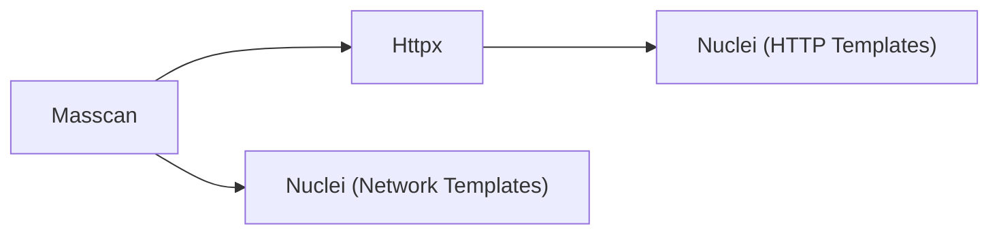

# Archer

| Distributed Scanning for the Masses

Archer is a distributed network and vulnerability scanner written in Golang. It's original goal was to perform efficient internet wide scans. Archer was built with speed and scalability in mind. No matter how many targets you have to scan, Archer can meet your needs.

Archer supports Scan Workflows which executes tools in a specific order, using results from previous steps for optimal results and scan time. It uses Elasticsearch scripting magic to maintain a single document per IP address per Scan, making it easy to organize and search through your results.

Archer comes with a CLI tool and API to easily interact with the scanner.

## Use Cases

* Internet wide scans
* Attack surface management
* Bug bounties & penetration testing
* Distributed fast scanning of large ranges

## Supported Tools

Archer uses a module system to execute any tool seamlessly. It uses industry battle tested tools and doesn't implement custom scanning techniques.

* Masscan
* HttpX
* Nuclei

New tools can be added by creating new modules. If you want to see a tool included, please create a issue with a link and use case!

## Workflows

Workflows allow executing multiple tools in succession. This uses results from the previous stage to allow for optimal results.

When executing a scan with all the tools available, the following happens:



Currently there is no support for custom workflows. If there are requests, I will implement it.

## Installation

1. Choose one of the following:
   1. Docker - `docker compose up -d`
   2. Manual - Install Redis, Postgresql, and Elasticsearch
2. Create a new Elasticsearch index using the file in [configs/elasticsearch.json](./configs/elasticsearch.json) (For docker see below)
3. Build components - `make all`
4. Configure files in the [configs folder](./configs) for each component
5. Start Coordinator with database migrations - `./dist/archer-coordinator -migrate`
6. Start Scheduler - `./dist/archer-scheduler`
7. Start Worker - `./dist/archer-worker`
8. Create new Scan with CLI below

## Docker Setup

### Create Elasticsearch Index

Execute the following curl command

```sh
curl -X PUT -k \
 -u "elastic:elastic" \
 -H "Content-Type: application/json" \
 -d @"configs/elasticsearch.json" \
 https://127.0.0.1:9200/archer
```

### View Results

1. Go to <http://127.0.0.1:5601> in your browser
2. Login with the following username and password - `elastic:elastic`
3. Open the sidebar menu and scroll down to "Stack Management" under "Management"
4. Click "Data Views" and create a new one
5. Enter "archer" for the name
6. Select the field "timestamp" for the timestamp field
7. Click "Create data view"
8. Open the sidebar menu and go to "Discover" under "Analytics"
9. Adjust the time range on the top right to see results

### Monitoring Tasks

You can monitor tasks using the Asynq Web UI at <http://localhost:8080>

## CLI Usage

The CLI is currently limited to only creating new scans. To monitor scan progress, check your Postgresql database.

Specific modules with single target and multiple ports

Internet Wide Scan

```sh
./dist/archer-cli -c configs/cli.yaml new -m all -t 0.0.0.0/0 -p 80 -p 443
```

```sh
./dist/archer-cli -c configs/cli.yaml new -m masscan -t 1.1.1.1 -p 80 -p 443
```

All modules with list

```sh
./dist/archer-cli -c configs/cli.yaml new -m all -l targets.txt
```

## Example Result

```json
{
  "_index" : "archer",
  "_id" : "67215d5bebdc30c792d17d6bef54c0d9695cd902",
  "_version" : 21,
  "_seq_no" : 30,
  "_primary_term" : 1,
  "found" : true,
  "_source" : {
    "ip" : "1.1.1.1",
    "scan" : "666kf2xdpu1k",
    "ports" : [
      {
        "metadata" : {
          "task" : "tjhgdrsphvdd",
          "module" : "masscan",
          "timestamp" : "2023-02-17T02:39:02.012817236Z"
        },
        "port" : 80
      },
      {
        "metadata" : {
          "task" : "tjhgdrsphvdd",
          "module" : "masscan",
          "timestamp" : "2023-02-17T02:39:02.11115321Z"
        },
        "port" : 443
      }
    ],
    "timestamp" : "2023-02-17T02:45:58.23592402Z",
    "http" : [
      {
        "metadata" : {
          "task" : "tmau646n49mg",
          "module" : "httpx",
          "timestamp" : "2023-02-17T02:39:19.932586378Z"
        },
        "scheme" : "http",
        "port" : 443,
        "title" : "400 The plain HTTP request was sent to HTTPS port"
      }
    ],
    "detections" : [
      {
        "severity" : "info",
        "metadata" : {
          "task" : "r339zsmiiib0",
          "module" : "nuclei",
          "timestamp" : "2023-02-17T02:45:56.345803529Z"
        },
        "matched_at" : "http://1.1.1.1:443",
        "port" : 443,
        "matcher_name" : "cloudflare",
        "name" : "Wappalyzer Technology Detection",
        "description" : "",
        "template_id" : "tech-detect",
        "type" : "http",
        "tags" : [
          "tech"
        ]
      },
      {
        "severity" : "info",
        "metadata" : {
          "task" : "r339zsmiiib0",
          "module" : "nuclei",
          "timestamp" : "2023-02-17T02:45:58.235956801Z"
        },
        "matched_at" : "http://1.1.1.1:443",
        "port" : 443,
        "matcher_name" : "permissions-policy",
        "name" : "HTTP Missing Security Headers",
        "description" : "This template searches for missing HTTP security headers. The impact of these missing headers can vary.",
        "template_id" : "http-missing-security-headers",
        "type" : "http",
        "tags" : [
          "misconfig",
          "headers",
          "generic"
        ]
      }
    ]
  }
}
```

## Optimizations

* Masscan
  * Dedicated Masscan workers with high network bandwidth
  * Test your server for the best Masscan packet rate
  * Only run 1 Masscan task per server (Use concurrency 1)
* Faster task executions
  * Deploy more workers and increase concurrency
* Faster task scheduling
  * Deploy more schedulers and increase concurrency
  * Monitor Elasticsearch for performance degradation

## Components

### Coordinator

The Coordinator is responsible for keeping track of all Scans and its Tasks. A Scan can have many tasks depending on the number of targets and available workers.

### Scheduler

The Scheduler is responsible for scheduling new tasks. It's main primary function is to query Elasticsearch for results from previous stages. Under the hood, the Scheduler is no different from the Worker. It processes scheduling tasks from a special Redis queue.

You can run multiple schedulers to horizontally scale with your scanning requirements.

### Worker

The worker is responsible for executing tasks given by the Scheduler. A worker can be configured to run a specific set of modules such as just Masscan or Nuclei and HttpX.

## Scan Lifecycle

1. Create new scan via CLI
2. API receives request
   1. Parse targets & stages
   2. Create new scan in Postgresql
   3. Create new parent task for first stage
      1. Get number of workers from Heartbeat service
      2. Create x number of child tasks in Postgresql
      3. Submit new task to Redis
3. Workers receives task
   1. Worker parses task data for targets
   2. Signal to Coordinator task start
   3. Spawn new child process for Scan tool
   4. Parse process output and bulk index to Elasticsearch
   5. Signal to Coordinator task finish with total number of results
4. Coordinator receives task finish
   1. Lock Postgresql parent task row
   2. Update child task status and results
   3. Check if all child tasks are finished
   4. Unlock parent task row
5. Coordinator determines all child tasks are finished
   1. Update scan's current stage in Postgresql
   2. Check for next stage in scan
   3. Check for total results in previous stage
   4. Fetch results from Elasticsearch
   5. **Repeat steps 3-5 with Elasticsearch results until all stages are complete**
6. Coordinator determines all stages are finished
   1. Update scan current stage to NULL
   2. Update scan status to complete
